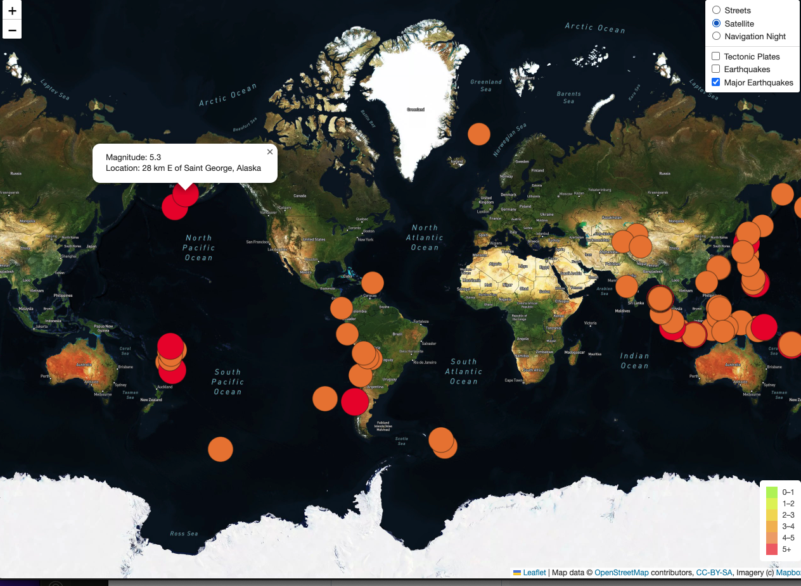

# Mapping_Earthquakes

## Overview 
The goal of this project is to create an interactive map to visualize the magnitudes of earthquakes all over the world for the past week. 

### This project was created with the following technology
1. Leaflet.js (JavaScript library for mobile-friendly interactive maps)
  - Leaflet in combination with [Mapbox API](https://docs.mapbox.com/api/overview/) was use for interactive visualizlation 
2. GeoJSON (A format for encoding a variety of geographic data structures)
  - The GeoJSON data was pulled from [USGS website](https://earthquake.usgs.gov/earthquakes/feed/v1.0/geojson.php)
3. D3.js (A JavaScript library for manipulating documents based on data. D3 bring data to life using HTML, SVG, and CSS)
4. HTML5/CSS 
5. Javascript 

### Map Types Included:
- Street  View 
- Satellite View
- Night Navigation 

### Earthquake Data Categoeries:
- Tectonic Plates

- Earthquakes

- Major Earthquakes (Earthquakes >4.5 mag)

- All data in Night Navaigation 

 

